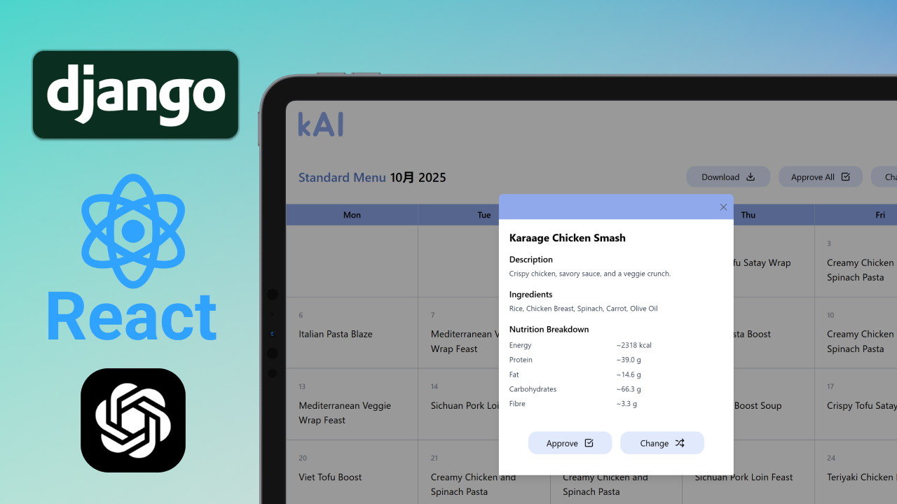
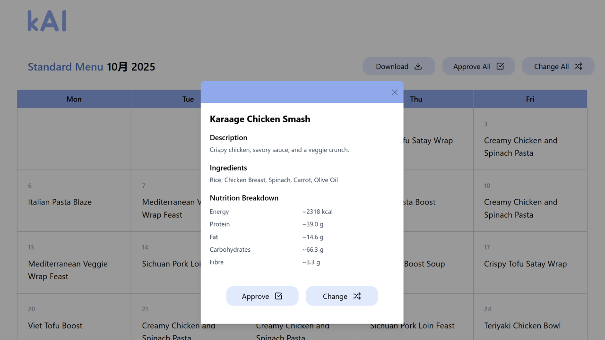
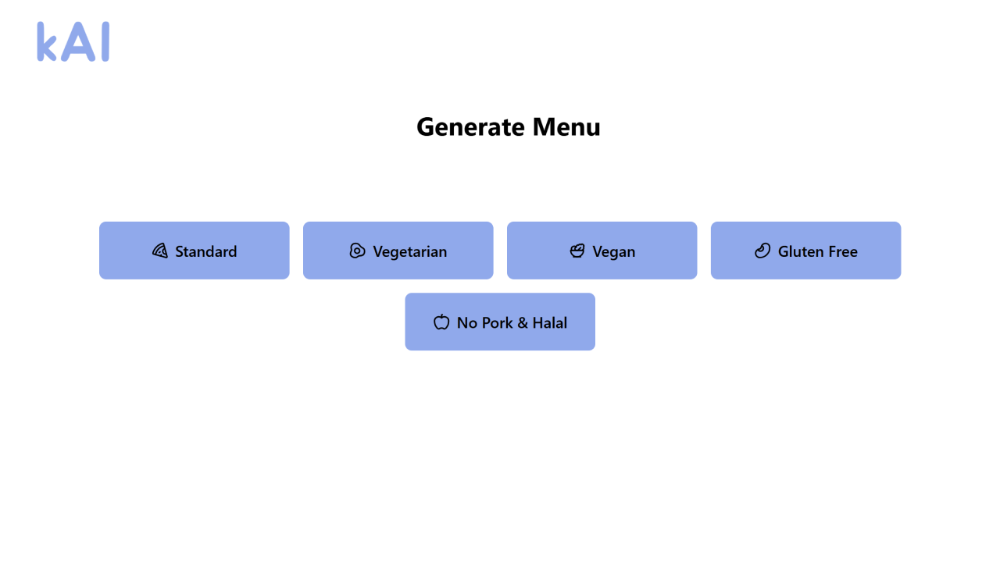
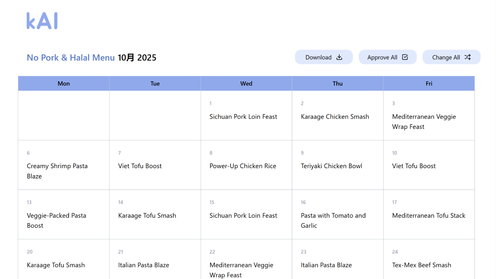

#  kAI — AI Menu Generator (Backend)

Backend service for **AI-driven school lunch menu generation**, built with **Django REST Framework** and **OpenAI GPT**.  
Designed during an AI Hackathon to help reduce food waste in New Zealand’s free school lunch program by generating **nutritious, budget-friendly $3 menus**.

---

## Features

- **AI-Generated Menus**  
  - Creates balanced, varied lunch menus using GPT with strict validation rules.  
  - Supports multiple dietary types: Standard, Vegetarian, Vegan, Halal, Gluten-free.  

- **Nutritional & Cost Validation**  
  - Ensures each menu meets energy, weight, and budget constraints.  
  - Automatically computes **total energy (kJ)**, **protein/fat/carbs/fiber**, and **cost (NZD)**.  

- **REST API Endpoints**  
  - `POST /api/generate-menus/` → generate AI menus, validate, and save to DB.  
  - `GET /api/monthly-menu/` → produce a **calendar-style menu** for the next month (Mon–Fri).  
  - `GET /api/meals/` → list, retrieve, create, update, or delete meals.  

- **Database Integration**  
  - Stores ingredients, meals, and recipes in PostgreSQL.  
  - Handles allergens, dietary tags, and nutritional metadata.

---

## Tech Stack

- **Backend:** Django, Django REST Framework  
- **Database:** PostgreSQL (SQLite supported for local dev)  
- **AI:** OpenAI GPT (prompt-based menu generation)  
- **Other:** Python 3.10+, Docker-ready setup possible  

## Screenshots

## Outcome

Delivered a working MVP in 48 hours during Hackathon.
Showcased potential to reduce food waste and improve student satisfaction.
Provides a foundation for scalable, AI-powered school meal planning systems.